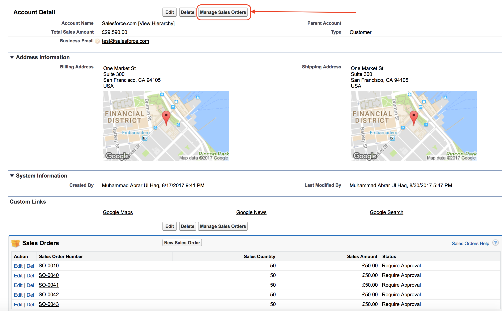
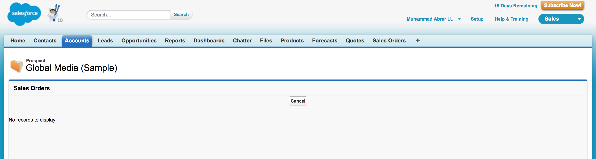
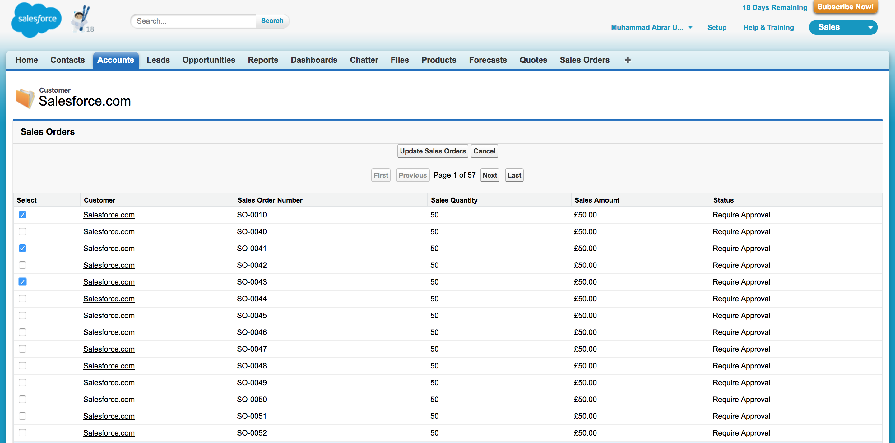
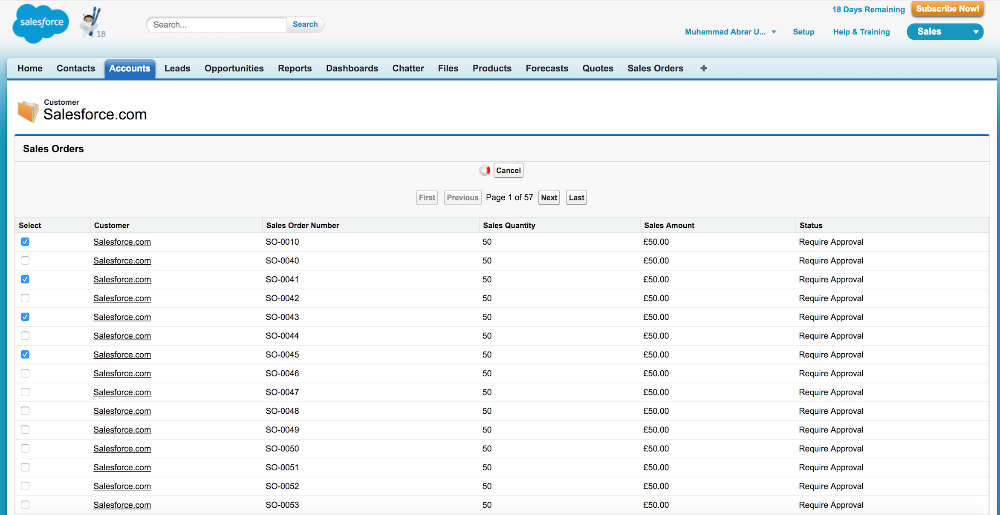
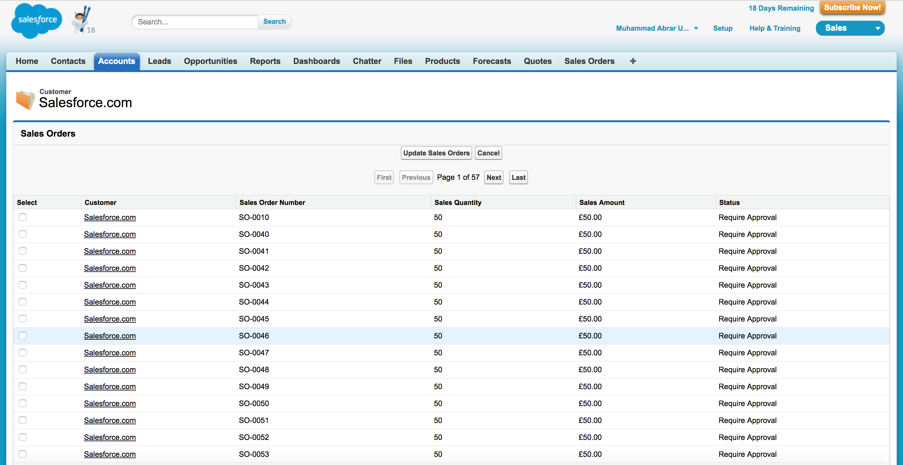

# Visualforce Pagination using StandardSetController

There are 2 main approaches of using Pagination in Visualforce world.
1. StandardSetController Built-In Pagination
2. SOQL OFFSET Pagination

Please read in detail about each of these here in <a href="https://developer.salesforce.com/docs/atlas.en-us.salesforce_visualforce_best_practices.meta/salesforce_visualforce_best_practices/vfbp_intro.htm">Visualforce Performance: Best Practices guide.</a>

Here you will find the most common and standard built-in pagination approach<a href="https://developer.salesforce.com/docs/atlas.en-us.pages.meta/pages/apex_pages_standardsetcontroller.htm"> "StandardSetController" </a>

#### ApexPages.StandardSetController features
1. Uses "StandardSetController" built-in pagination functionality in list controllers to prevent list views from displaying unbounded data.
2. Unbounded data might cause longer load times, hit governor limits, and become unusable as the data set grows.
3. By default, a list controller returns 20 records on the page, but developers often configure list views to display up to 100 records at a time.
4. To control the number of records each page displays, uses a "setPageSize" property of ApexPages.StandardSetController.

#### Example Considerations:
1. Here in this example we have Account (a standard object) and SalesOrder__c (a custom object).
2. There is a Lookup relationship between Account and SalesOrder__c. An Account can have one "or many SalesOrder__c records.
3. There is a custom button "Manage Sales Orders" on Account detail page

4. A controller class "SalesOrderController" of a custom object "SalesOrder__c" and a Visualforce page "SalesOrderPagination".
(a) This page shows "SalesOrder__c" records associated to an Account record using a Field Set fields and Dynamic query.

(b) The page will have a functionality to select one "or" more "SalesOrder__c" records to perform Update/Delete operation.

(c) In order to achieve above functionality the page uses a wrapper class "SalesOrderWrapper".
(d) The page has Pagination functionality with buttons "First", "Previous", "Next", "Last".

(e) A page show maximum 25 records at a time. You can change this setting in "PaginationUtility" class by using a custom setting etc.
(f) The page tracks the Selected/UnSelected SalesOrder__c record(s) with Pagination.

